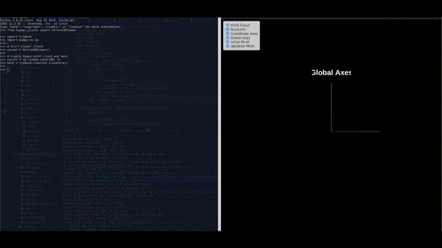
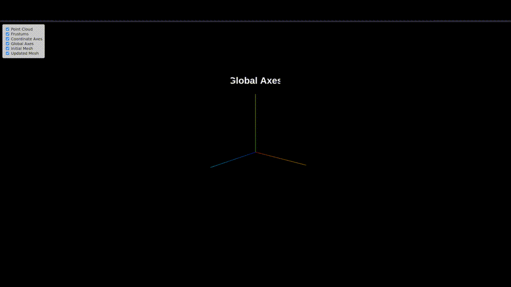

# 🔭 3D Visualizer

A lightweight 3D visualizer built with **Flask** and **Three.js**.  
It lets you render meshes, point clouds, frustums, and coordinate axes in the browser — all controlled live via a Python API.

---

## 📦 Features

- ✅ Render point clouds and triangle meshes  
- ✅ Add camera frustums (green = random, red = known view)  
- ✅ Show object and global coordinate systems  
- ✅ Toggle visibility of individual elements (e.g. frustums, mesh)  
- ✅ OrbitControls to rotate, pan, and zoom the view  
- ✅ Light automatically follows the camera  

---

## 🚀 Quick Start

### 1. Install dependencies

```bash
pip install flask flask-cors
```

---

### 2. Run the server

```bash
python app.py
```

🌐 Open the browser at: [http://localahost:{YOUR-PORT-HERE}](http://localhost:{your-port-here})

---

### 3. Example usage from Python

```python
from viewer_client import Online3DViewer
import trimesh
import numpy as np

# Start viewer client
viewer = Online3DViewer()

# Create dummy point cloud and mesh
points = np.random.rand(100, 3)
mesh = trimesh.creation.icosphere()

# Load mesh and point cloud
viewer.load_scene(mesh=mesh, pointcloud=points)

# Add camera frustums
pose_matrix = np.eye(4)
viewer.add_frustum(pose_matrix)  # Default green

# Red frustum for known views
viewer.add_frustum(pose_matrix, color='red')

# Add coordinate axis
viewer.add_object_axis(pose_matrix, label="Object Frame")

# Show global XYZ
viewer.add_global_axes()

# Update mesh
viewer.update_mesh(mesh, label="epoch_1")
```


---

## 🧪 Demo

You can run a full demonstration using real mesh data (Stanford Bunny) to showcase all interactive features: mesh updates, frustum visualization, global/object axes, and orbiting motion.

This demo:
- Loads the Stanford Bunny mesh
- Centers it at the origin
- Iteratively updates the mesh position and orientation along a circular orbit
- Visualizes each iteration with a new green frustum and labeled object axis
- Adds a red frustum for a known view

### 🔁 Iterative Mesh Update Demo

To run it:

```bash
python run_demo.py
```

### 🐇 Demo Preview



### 🗂️ Demo Folder Structure

```
demo/
└── bunny/
    └── reconstruction/
        └── bun_zipper_res3.ply
```

Ensure that the `bun_zipper_res3.ply` file is present in the path above.

You can download the Stanford Bunny `.ply` file from the [Stanford 3D Scanning Repository](http://graphics.stanford.edu/data/3Dscanrep/) if needed.

---

## 💡 Notes

- Works best with recent versions of Chrome or Firefox  
- Designed for local visual debugging — not production  
- Easily embeddable in larger training/experiment loops


Inspired by the needs of fast real-time mesh and pose inspection during model training.
