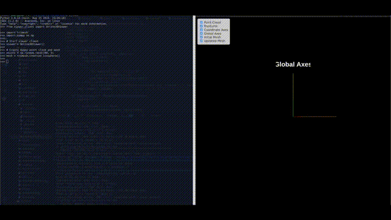
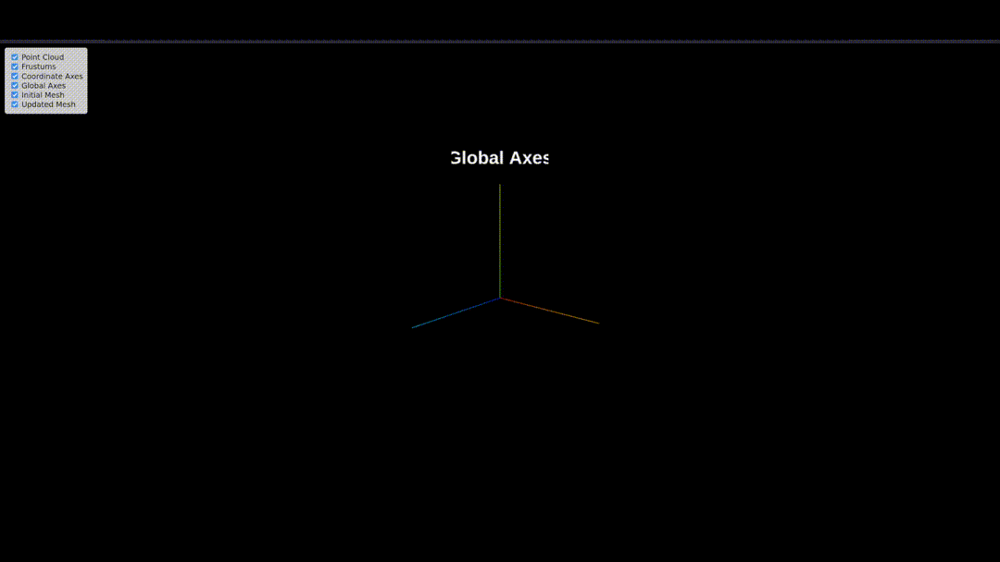

# 🔭 3D Visualizer

A lightweight 3D visualizer built with **Flask** and **Three.js**.  
It lets you render meshes (Trimesh), point clouds, frustums, and coordinate axes in the browser — all controlled live via a Python API.

---

## 📦 Features

- ✅ Render point clouds and triangle meshes  
- ✅ Add camera frustums (green = random, red = known view)  
- ✅ Show object and global coordinate systems  
- ✅ Toggle visibility of individual elements (e.g. frustums, mesh)  
- ✅ OrbitControls to rotate, pan, and zoom the view  
- ✅ Light automatically follows the camera  

---

## 🚀 Quick Start

### 1. Install dependencies

```bash
pip install flask flask-cors
```

---

### 2. Run the server

```bash
python app.py
```

🌐 Open the browser at: [http://localahost:{YOUR-PORT-HERE}](http://localhost:{your-port-here})

---

### 3. Example usage from Python

```python
from viewer_client import Online3DViewer
import trimesh
import numpy as np

# Start viewer client
viewer = Online3DViewer()

# Create dummy point cloud and mesh
points = np.random.rand(100, 3)
mesh = trimesh.creation.icosphere()

# Load mesh and point cloud
viewer.load_scene(mesh=mesh, pointcloud=points)

# Add camera frustums
pose_matrix = np.eye(4)
viewer.add_frustum(pose_matrix)  # Default green

# Red frustum for known views
viewer.add_frustum(pose_matrix, color='red')

# Add coordinate axis
viewer.add_object_axis(pose_matrix, label="Object Frame")

# Show global XYZ
viewer.add_global_axes()

# Update mesh
viewer.update_mesh(mesh, label="epoch_1")

# Update pointcloud
viewer.update_point_cloud(points+2, label="epoch_1")
```


---

## 🧪 Demo

You can run a full demonstration using real mesh data (Stanford Bunny) to showcase all interactive features: mesh updates, frustum visualization, global/object axes, and orbiting motion.

This demo:
- Loads the Stanford Bunny mesh
- Centers it at the origin for frame 0 alongside a reference point cloud
- Animates 36 steps of rotation, tilt, uniform scaling, and orbital translation
- Streams a chase camera frustum plus an overhead frustum for each step
- Keyframes mesh, axes, and highlight point clouds so Blender frames match remote steps

### 🔁 Iterative Mesh Update Demo

To run it:

```bash
python run_demo.py
```

### 🐇 Demo Preview



### 🗂️ Demo Folder Structure

```
demo/
└── bunny/
    └── reconstruction/
        └── bun_zipper_res3.ply
```

Ensure that the `bun_zipper_res3.ply` file is present in the path above.

You can download the Stanford Bunny `.ply` file from the [Stanford 3D Scanning Repository](http://graphics.stanford.edu/data/3Dscanrep/) if needed.

---

## 💡 Notes

- Works best with recent versions of Chrome or Firefox  
- Designed for local visual debugging — not production  
- Easily embeddable in larger training/experiment loops


## 🧩 Blender Integration (Local Viewer)

If you prefer to inspect the remote scene inside Blender instead of the browser, you can run the Blender client locally while your remote training job keeps posting to the Flask server.

1. Ensure Blender's Python can import `requests` and that this repository path is added to `sys.path` (for example, `sys.path.append('/path/to/diffusion-prior')`).
2. In Blender's Scripting workspace run:

```python
from visualizer3d import blender_client
bridge = blender_client.start(host='http://localhost:5000', interval=1.0)
```

   Adjust the host if you port-forward the Flask server from the remote machine.
3. When finished, stop the sync with:

```python
from visualizer3d import blender_client
blender_client.stop()
```

The client mirrors meshes, frustums, point clouds, and axes into a dedicated `Visualizer3D Remote Scene` collection to keep the imported data isolated from the rest of your file.
When the remote code increments its step counter, the Blender bridge records a matching keyframe (frame = step) so scrubbing the timeline reproduces the browser slider behaviour; only the objects for the current step are visible on that frame.


Inspired by the needs of fast real-time mesh and pose inspection during model training.
